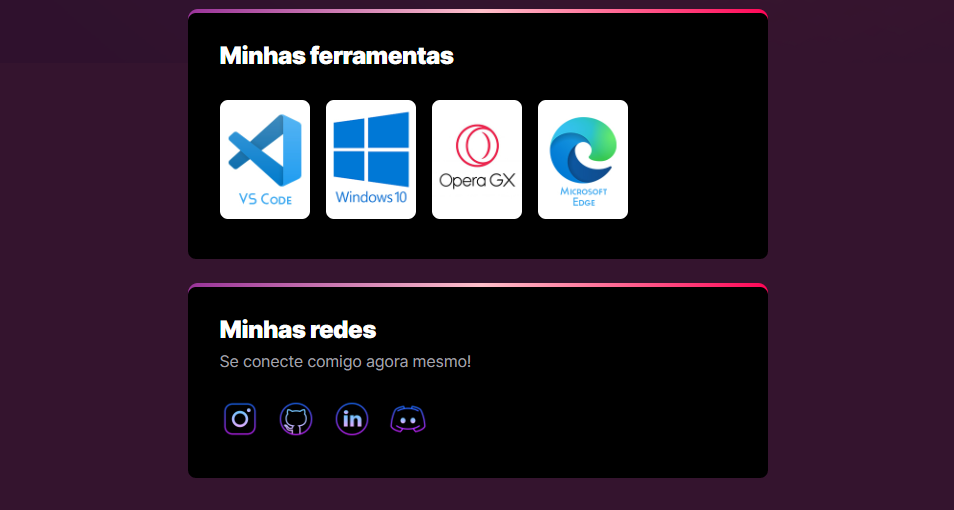

# Trilha Explorer - O que estudo 👩‍💻📚

> ⛓ Trilha Explorer ⛓

Projeto feito no evento Next Level Week, disponibilizado pela Rocketseat, porém usei a ideia do projeto principal
para fazer uma apresentação sobre mim e o que estou estudando atualmente 🚀
Mentoria: Mayk Brito.

[🔗 Clique aqui para acessar](https://ketillyqueiroz.github.io/O-que-estudo)

## Tecnologias 🧩

-> HTML5.
-> CSS3
-> Git e Github

## Contato 📲

Instagram: @ketilly.keyce
Gmail: ketillyunicsul@gmail.com
